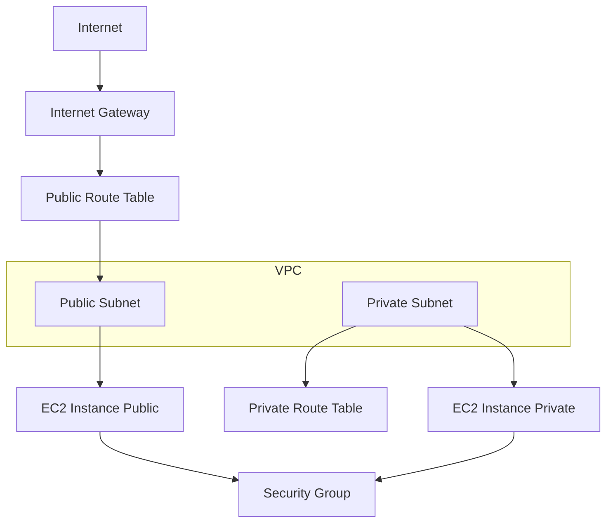

Got you — you want it to sound **personal, like you actually built it** (which you did). Here’s a polished version with that tone 👇

---

# 🚀 Terraform AWS Lab – VPC + EC2 Deployment

## 📌 Overview

In this project, I designed and deployed a complete AWS infrastructure using Terraform, covering both **networking (VPC)** and **compute (EC2)** layers.

The goal was to build a **production-like, secure, and scalable environment** using Infrastructure as Code (IaC) and follow real-world cloud architecture practices.

---

## 🏗️ Project Structure

```bash
Terraform-AWS-LAB/
│── AWS-VPC/               # VPC, Subnets, Route Tables, IGW
│── AWS-EC2/               # EC2, Security Groups, AMI, Subnet Data
│── .github/workflows/     # CI/CD (Terraform automation)
│── README.md
```

---

## 🧩 Architecture Diagram



---

## ⚙️ What I Implemented

### 🔹 AWS-VPC Module

* I created a custom VPC with a defined CIDR range
* I configured public and private subnets for proper network isolation
* I attached an Internet Gateway to allow external connectivity
* I implemented route tables and subnet associations

### 🔹 AWS-EC2 Module

* I deployed EC2 instances using Terraform
* I used data sources to fetch AMI, VPC, and subnet details dynamically
* I configured Security Groups to control inbound and outbound traffic
* I ensured secure access and communication between resources

---

## 🔐 Key Features

* Implemented network isolation between public and private subnets
* Secured infrastructure using Security Groups
* Followed modular Terraform structure for better scalability
* Designed a real-world cloud architecture setup

---

## 🔄 Traffic Flow

1. I created a VPC with both public and private subnets
2. Internet access is enabled through the Internet Gateway
3. Public subnet allows external access, while private subnet remains isolated
4. EC2 instances are deployed within the respective subnets
5. Security Groups manage and restrict traffic

---

## 💼 Project Summary

* Designed and deployed AWS VPC with public and private subnets using Terraform
* Provisioned EC2 instances with Security Groups for secure access
* Configured Internet Gateway and Route Tables for traffic routing
* Used Terraform data sources and modular approach for scalability
* Built a production-like infrastructure combining networking and compute

---


* Make this even sharper for **ATS resume (2–3 bullet killer points)**
* Or prepare **interview Q&A based on this project (very useful for your role target)**
