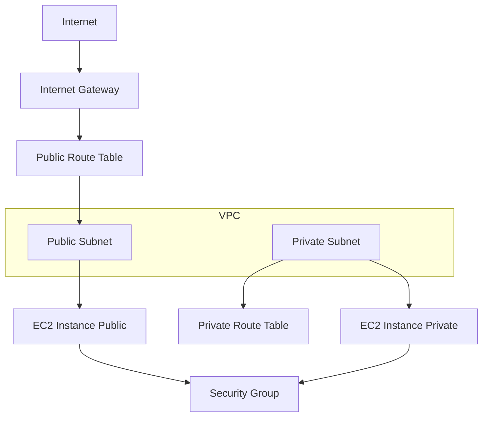

# 🚀 Terraform AWS Lab – VPC + EC2 Deployment

## 📌 Overview

In this project, I designed and deployed a complete AWS infrastructure using Terraform, covering both **networking (VPC)** and **compute (EC2)** layers.

I also implemented **CI/CD using GitHub Actions** to automate Terraform deployments, making the setup closer to a real-world production environment.

---

## 🏗️ Project Structure

```bash
Terraform-AWS-LAB/
│── AWS-VPC/               # VPC, Subnets, Route Tables, IGW
│── AWS-EC2/               # EC2, Security Groups, AMI, Subnet Data
│── .github/workflows/     # Terraform CI/CD pipelines
│── README.md
```

---

## 🧩 Architecture Diagram



---

## ⚙️ What I Implemented

### 🔹 AWS-VPC Module

* Created a custom VPC with defined CIDR range
* Configured public and private subnets
* Attached Internet Gateway for external connectivity
* Implemented route tables and subnet associations

### 🔹 AWS-EC2 Module

* Deployed EC2 instances using Terraform
* Used data sources (AMI, VPC, Subnet) for dynamic configuration
* Configured Security Groups to control inbound and outbound traffic
* Ensured secure communication between resources

---

## 🔄 CI/CD Automation (GitHub Actions)

* Built automated workflows for Terraform deployment using GitHub Actions
* Triggered pipelines based on changes in VPC and EC2 modules
* Implemented full Terraform lifecycle: **init → validate → plan → apply**
* Used GitHub Secrets for secure AWS credential management
* Added **manual approval step** before applying changes to production
* Created separate workflows for safe infrastructure destruction

---

## 🔐 Key Features

* Network isolation using public and private subnets
* Secure access using Security Groups
* Infrastructure as Code (Terraform)
* CI/CD automation for deployment
* Manual approval control for production changes
* Modular and scalable architecture

---

## 🔄 Traffic Flow

1. VPC is created with public and private subnets
2. Internet Gateway enables access for public subnet
3. EC2 instances are deployed within respective subnets
4. Security Groups control traffic flow
5. Private subnet remains isolated for security

---

## 💼 Project Summary

* Designed and deployed AWS VPC with public and private subnets using Terraform
* Provisioned EC2 instances with Security Groups for secure access
* Configured Internet Gateway and Route Tables for traffic management
* Implemented CI/CD pipelines using GitHub Actions for automated deployment
* Used modular Terraform and data sources for scalable infrastructure design
* Built a production-like cloud environment combining networking and compute

---
